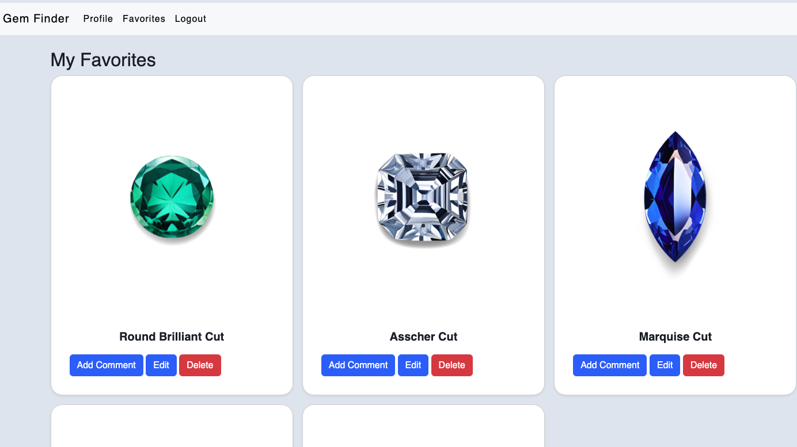

# `Gem Finder`
Are you curious about building a ring, either for engagement, a gift, or otherwise? Gem Finder is a great place to start! It allows you to browse numerous gems by gem type, where you can even explore what different cuts of this gem would look like. You can save gems you like to your "favorites," and from there you can edit the gem name, add notes about the gem, and so on. Ultimately, this app allows you to explore many gems with ease as you begin the process of deciding what type of ring you would like. 

Heroku link: link

## Libraries, Languages, and Frameworks Used:
JAVASCRIPT
NODE.JS
EXPRESS.JS
BOOTSTRAP
POSTGRESQL
CSS
HTML5

### Installation Instructions:
Please note: it requires Node.js, Postgres, and Sequelize
1. Fork + Clone this repo to your terminal
2. Run npm install
3. Run sequelize db:migrate:all, then sequelize db:seed:all to set up the database
4. Run npm start to start the server
5. Open http://localhost:4000 in a web browser to access app.

## `1` Wireframe
login page:

Sign-in page:

Home page:

Selected gem page:

User favorites page:

Add a comment on a gem:

Display comment on edited gem:

Edit gem name:

See your profile:

Edit your profile:

Delete fields in profile by hovering over them:

## `2` Navigating the Website
1. You will first come up on the authorization login page, where you will be asked to either sign up or login 
2. If you sign up, you will be redirected to the login page to then log in 
3. You will then be brought to the home page, which will encourage you to browse through different gems by type
4. You can click on any of these gem cards, and you will be redirected to a route that has all the cuts for that gem type
5. If you see a gem you like, you can click, "add to favorites"
6. In the nav bar, you will see there is a favorites section. If you click on it, it will bring you to your favorites, where you will see any/all gems you have added to your favorites. 
7. While in your favorites, you can edit the gem's name, add a comment to that gem, edit or delete the comment, or delete the gem from your favorites entirely.
8. There is also a profile section in your navbar. If you click on that, it will bring you to your profile. From there, you can edit your profile by adding "about me" or "website" fields, and you can also delete these fields at will.

## `3` Blockers
1. Figuring out favorites model
2. Figuring out how to add comments to favorites for user and ensuring it wouldn't impact other gems user doesn't have authorization to use
3. Making sure the favorites section had all gems, regardless of type

## `4` Reach goals
1. Creating a search boxs that would allow for user to serach by gem type of gem cut
2. Eventually add more datatables, such as carat size for gem, ring settings, ring band types, etc
3. Create the logic for a user to be able to see what their gem would look like on a ring material of their choice
4. Create the logic for user accounts to be abel to friend one another and share favorited gems
5. Create the logic that would search the internet for rings/pricing based on created rings user has under favorites
